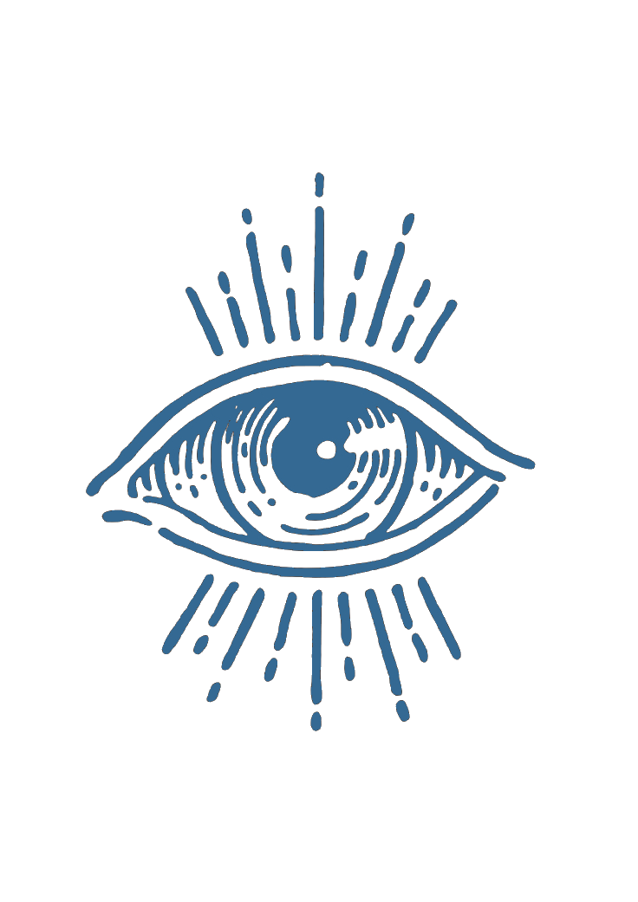

<!-- ei, o que está fazendo aqui? -->
<!-- Title as SVG for consistent colors -->

  

<!-- banner -->

  

 

<!-- bio -->

	
𝐆𝐚𝐦𝐞 𝐩𝐫𝐨𝐠𝐫𝐚𝐦𝐦𝐞𝐫 𝐚𝐧𝐝 𝐚𝐮𝐭𝐨𝐦𝐚𝐭𝐢𝐨𝐧 𝐞𝐧𝐭𝐡𝐮𝐬𝐢𝐚𝐬𝐭.   𝐂𝐮𝐫𝐫𝐞𝐧𝐭𝐥𝐲 𝐝𝐞𝐬𝐢𝐠𝐧𝐢𝐧𝐠 𝐚 𝐏𝐲𝐭𝐡𝐨𝐧 𝐛𝐨𝐭 𝐟𝐨𝐫 𝐃𝐢𝐬𝐜𝐨𝐫𝐝 𝐰𝐢𝐭𝐡   𝐝𝐚𝐭𝐚𝐛𝐚𝐬𝐞 𝐢𝐧𝐭𝐞𝐠𝐫𝐚𝐭𝐢𝐨𝐧 𝐭𝐨 𝐜𝐨𝐧𝐭𝐫𝐨𝐥 𝐚𝐧 𝐑𝐏𝐆 𝐬𝐲𝐬𝐭𝐞𝐦 — ["𝐓𝐡𝐞 𝐎𝐫𝐚𝐜𝐥𝐞 𝐏𝐫𝐨𝐣𝐞𝐜𝐭."](https://github.com/oorpheas/TheOracleProject)   𝐒𝐭𝐮𝐝𝐲𝐢𝐧𝐠 𝐭𝐨 𝐛𝐞𝐜𝐨𝐦𝐞 𝐚 𝐂𝐨𝐦𝐩𝐮𝐭𝐞𝐫 𝐄𝐧𝐠𝐢𝐧𝐞𝐞𝐫.

 

<!-- table -->
<table align="center" width="100%" cellpadding="12">
  <tr>
    <th align="center">𝐀𝐛𝐢𝐥𝐢𝐭𝐢𝐞𝐬</th>
    <th align="center">𝐒𝐭𝐚𝐭𝐬</th>
  </tr>
  <tr>
    <td width="50%" align="left">
        𝐃𝐞𝐯𝐞𝐥𝐨𝐩𝐞𝐫 𝐔𝐧𝐢𝐭𝐲 · 𝟐 𝐲𝐞𝐚𝐫𝐬; 
        𝐃𝐞𝐯𝐞𝐥𝐨𝐩𝐞𝐫 𝐂𝐒𝐡𝐚𝐫𝐩 · 𝟐 𝐲𝐞𝐚𝐫𝐬; 
        𝐃𝐞𝐯𝐞𝐥𝐨𝐩𝐞𝐫 𝐏𝐲𝐭𝐡𝐨𝐧 · 𝟐 𝐲𝐞𝐚𝐫𝐬; 
        𝐆𝐚𝐦𝐞 𝐀𝐫𝐭𝐢𝐬𝐭 · +𝟓 𝐲𝐞𝐚𝐫𝐬; 
    </td>
    <td width="60%" align="center">
      
    </td>
  </tr>
</table>

 

<!-- links -->

  
  
  
  

<!-- logos -->

   

 

 

<!-- footer -->

	  𝐭𝐫𝐚𝐧𝐬 𝐫𝐢𝐠𝐡𝐭𝐬 𝐚𝐫𝐞 𝐡𝐮𝐦𝐚𝐧 𝐫𝐢𝐠𝐡𝐭𝐬.  

	

<!-- https://dev.to/envoy_/150-badges-for-github-pnk#games -->
