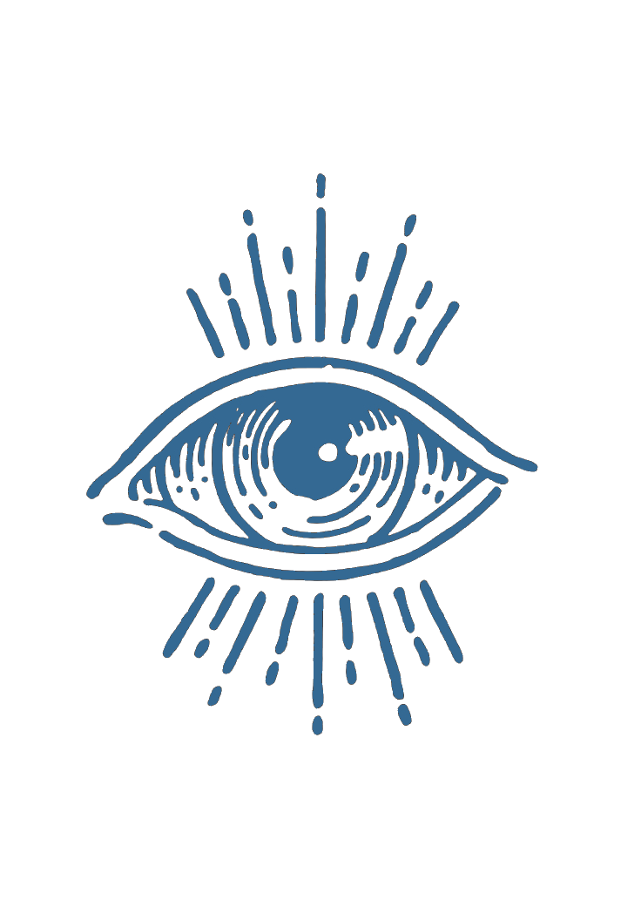

<!-- ei, o que está fazendo aqui? -->
<!-- Title as SVG for consistent colors -->
#
 

  

#

<!-- banner -->

  

#

 

<!-- bio -->

𝐉𝐮𝐧𝐢𝐨𝐫 𝐒𝐨𝐟𝐭𝐰𝐚𝐫𝐞 𝐃𝐞𝐯𝐞𝐥𝐨𝐩𝐞𝐫, 𝐃𝐢𝐠𝐢𝐭𝐚𝐥 𝐆𝐚𝐦𝐞 𝐏𝐫𝐨𝐠𝐫𝐚𝐦𝐦𝐢𝐧𝐠 𝐭𝐞𝐜𝐡𝐧𝐢𝐜𝐢𝐚𝐧, 𝐚𝐧𝐝 𝐜𝐫𝐞𝐚𝐭𝐨𝐫 𝐨𝐟 𝐭𝐡𝐞 𝐭𝐞𝐱𝐭-𝐛𝐚𝐬𝐞𝐝 𝐑𝐏𝐆 [𝐈𝐧𝐬𝐭𝐢𝐭𝐮𝐭𝐨 𝐊𝐚𝐢𝐫𝐨𝐬](https://github.com/Instituto-Kairos). 𝐌𝐲 [𝐩𝐨𝐫𝐭𝐟𝐨𝐥𝐢𝐨](https://oorpheas.github.io/) 𝐚𝐧𝐝 [𝐨𝐧𝐞 𝐨𝐟 𝐦𝐲 𝐠𝐚𝐦𝐞𝐬](https://oorpheas.itch.io/bad-neighborhood). [𝐋𝐞𝐭 𝐦𝐞 𝐤𝐧𝐨𝐰](mailto:orfeu.dev@gmail.com) 𝐢𝐟 𝐚𝐧𝐲𝐭𝐡𝐢𝐧𝐠 𝐜𝐚𝐭𝐜𝐡𝐞𝐬 𝐲𝐨𝐮𝐫 𝐞𝐲𝐞. 

#
<!--   𝐒𝐭𝐮𝐝𝐲𝐢𝐧𝐠 𝐭𝐨 𝐛𝐞𝐜𝐨𝐦𝐞 𝐚 𝐂𝐨𝐦𝐩𝐮𝐭𝐞𝐫 𝐄𝐧𝐠𝐢𝐧𝐞𝐞𝐫. -->

 

<!-- table -->
<table align="center" width="100%" cellpadding="12">
  <tr>
    <td align="left">
        𝐃𝐚𝐫𝐭 · +𝟔 𝐦𝐨𝐧𝐭𝐡𝐬; 
        𝐅𝐥𝐮𝐭𝐭𝐞𝐫 · +𝟔 𝐦𝐨𝐧𝐭𝐡𝐬; 
        𝐆𝐨𝐥𝐚𝐧𝐠 · +𝟔 𝐦𝐨𝐧𝐭𝐡𝐬; 
    </td>
    <td align="left">
        𝐆𝐢𝐭 · +𝟐 𝐦𝐨𝐧𝐭𝐡𝐬; 
        𝐔𝐧𝐢𝐭𝐲 · +𝟑 𝐲𝐞𝐚𝐫𝐬; 
        𝐂𝐒𝐡𝐚𝐫𝐩 · +𝟑 𝐲𝐞𝐚𝐫𝐬; 
    </td>
</tr>
<tr>
    <td align="left">
        𝐏𝐨𝐬𝐭𝐠𝐫𝐞𝐬𝐬 · +𝟔 𝐦𝐨𝐧𝐭𝐡𝐬;  
        𝐇𝐓𝐌𝐋 · +𝟑 𝐲𝐞𝐚𝐫𝐬; 
        𝐆𝐚𝐦𝐞 𝐀𝐫𝐭𝐢𝐬𝐭 · +𝟓 𝐲𝐞𝐚𝐫𝐬; 
    </td>
    <td align="left">
        𝐂𝐒𝐒 · +𝟐 𝐲𝐞𝐚𝐫𝐬; 
        𝐉𝐚𝐯𝐚𝐒𝐜𝐫𝐢𝐩𝐭 · +𝟏 𝐲𝐞𝐚𝐫𝐬; 
        𝐏𝐲𝐭𝐡𝐨𝐧 · +𝟑 𝐲𝐞𝐚𝐫𝐬; 
    </td>
  </tr>
</table>

 

<!-- links -->

  
  
  
  

<!-- logos -->

  

 

 

<!-- footer -->

	  𝐭𝐫𝐚𝐧𝐬 𝐫𝐢𝐠𝐡𝐭𝐬 𝐚𝐫𝐞 𝐡𝐮𝐦𝐚𝐧 𝐫𝐢𝐠𝐡𝐭𝐬.  

	

<!-- https://dev.to/envoy_/150-badges-for-github-pnk#games -->
